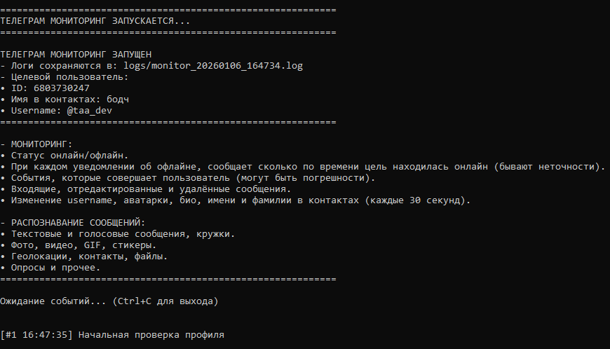

# slezhka-tg
> [!WARNING]
> - ### Убедительная просьба сначала прочитать от начала до конца README, а потом скачивать и настраивать софт. Звёздочки в конце предложения означают, что дальше это объяснится подробнее.
##
> [!NOTE]
> - #### Это моя первая работа и я впервые что-то выкладываю на гитхаб, не судите строго, пожалуйста :D
> - #### Всё, что было на уме и всё, что мог, я реализовал в последней версии, которую я выложил. Если есть идеи, что можно добавить - *предлагайте!*
##
> [!IMPORTANT]
> ## Как это работает:
> - #### Программа подключается к **Telegram API** как обычный клиент.
> - #### Использует ваши `api_id` и `api_hash` (берутся из файла `.env`).
> - #### Создает файл сессии `session.session` для авторизации.
> - #### Следит за одним конкретным пользователем, чей ID указан в `.env`.
> - #### Примечание: так как cофт ищет по ID, вам нужно иметь чат с объектом слежки (можно просто написать точку и удалить её, чтобы софт смог найти собеседника). 
##

> другие примеры работы софта смотрите в папке [`images`](https://github.com/tapatuli4kaa/slezhka-tg/tree/main/images)

## Требования:
- [Python](https://www.python.org/downloads/) 3.9+

## Что софт делает:
#### Мониторит и сообщает про:
- Статус онлайн/офлайн.
- При каждом уведомлении об офлайне, сообщает сколько по времени цель находилась онлайн (бывают неточности*).
- События, которые совершает пользователь (могут быть погрешности**).
- Входящие, отредактированные и удалённые сообщения.
- Изменение username, аватарки, био, имени и фамилии в контактах (каждые 30 секунд).

#### Распознаёт и сообщает про:
- Текстовые и голосовые сообщения, кружки.
- Фото, видео, GIF, стикеры.
- Геолокации, контакты, файлы.
- Опросы и прочее.

> А самое главное - логгирует каждый запуск***. И при всём этом - ваш статус онлайн/оффлайн не меняется, а сообщения не читаются, но отображаются в консоли и логах.

## Технические ограничения:
- Видит только публичную информацию профиля.
- Не может получить био, если у пользователя настройки приватности.
- *Когда сообщает о том, сколько по времени цель была в онлайне, бывают неточности, в связи с тем, что сессия Telegram длится ±5 минут.

## Что не может делать никак:
- Показывать содержимое переписки с другими людьми.
- Читать секретные чаты (Secret Chats).
- Следить, если пользователь заблокировал ваш аккаунт.

## ***Система логгирования:
- Все события пишутся в лог-файл.
- Формат логов: `YYYY-MM-DD HH:MM:SS - LEVEL - MESSAGE`.
- Имя файла: `monitor_YYYYMMDD_HHMMSS.log` (уникальное для каждого запуска).

## Гайд, чтобы всё работало:
- Скачиваем `slezhka.py`.
- Создайте папку и поместите в неё софт.
- Создайте в той же папке файл `.env` по инструкции ниже.
- Запускаем софт и кайфуем.

## Создание и настройка `.env`
1. Создайте в папке текстовый документ и вставьте в него это с вашими корректировками:
```ini
API_ID=ваш_api_id
API_HASH=ваш_api_hash
TARGET_USER_ID=id_вашей_цели
```
- api_id и api_hash делаем [тут](https://my.telegram.org/apps).
2. **CTRL+SHIFT+S**, затем меняете тип файла на "Все файлы" и в названии пишите `.env`.
3. Сохраняете в папку с софтом и готово!

## Возможные проблемы:
- no module named '`модуль`' = пишите в консоль pip install `модуль`.
- зависла консоль = нажмите **enter** на клавиатуре.
- **не отображаются события типа: "печатает", "записывает голосовое собщения" и т.д. = либо цель пользуется клиентом с "режимом призрака", либо вы не открывали чат с целью в последнее время, либо у вас нет общего чата (но! сообщать, когда вам отправили сообщение стопроцентно будет).

> ###### пока всё!1!! ;)
