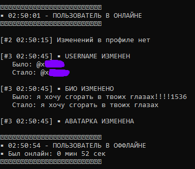

# slezhka-tg
> Убедительная просьба сначала прочитать от начала до конца README, а потом скачивать и настраивать софт. Звёздочки в конце предложения означают, что дальше это объяснится подробнее. И я впервые что-то выкладываю на гитхаб, не судите строго, пожалуйста :D
- Это сборщик изменений о ТГ аккаунте. Софт ищет по айди, поэтому вам нужно иметь чат с объектом слежки (можно просто написать точку и удалить её, чтобы софт смог найти собеседника). Есть недочётики, но я их в скором времени исправлю :P




## Что он делает:
1. Следит и отправляет, когда человек онлайн или офлайн.
2. Сколько по времени пользователь находился в сети за сессию захода (бывают неточности, в связи с тем, что сессия Telegram длится 5 минут).
3. Проверяет и сообщает об изменениях имени и фамилии, юзернейма, аватарки и био ("обо мне")
4. Логгирует каждый запуск*.

## Гайд, чтобы всё работало:
- Скачиваем `slezhka.py`.
- Создайте папку и поместите в неё софт.
- Создайте в той же папке файл .env по инструкции**.
- api_id и api_hash делаем [тут](https://my.telegram.org/apps).
- Запускаем софт и кайфуем.

## *Система логгирования:
- Все события пишутся в лог-файл.
- Формат: `YYYY-MM-DD HH:MM:SS - LEVEL - MESSAGE`.
- Имя файла: `monitor_YYYYMMDD_HHMMSS.log` (уникальное для каждого запуска).

## **Создание и настройка .env
1. Создайте в папке текстовый документ и вставьте в него это с вашими корректировками:
```ini
API_ID=ваш_api_id
API_HASH=ваш_api_hash
TARGET_USER_ID=id_вашей_цели
```
2. **CTRL+SHIFT+S**, затем меняете тип файла на "Все файлы" и в названии пишите `.env`
3. Сохраняете в папку с софтом и готово!

## Возможные ошибки:
- no module named '`модуль`' = пишите в консоль pip install `модуль`
- зависла консоль = нажмите **enter** на клавиатуре

###### пока что всё!1!! ;)
